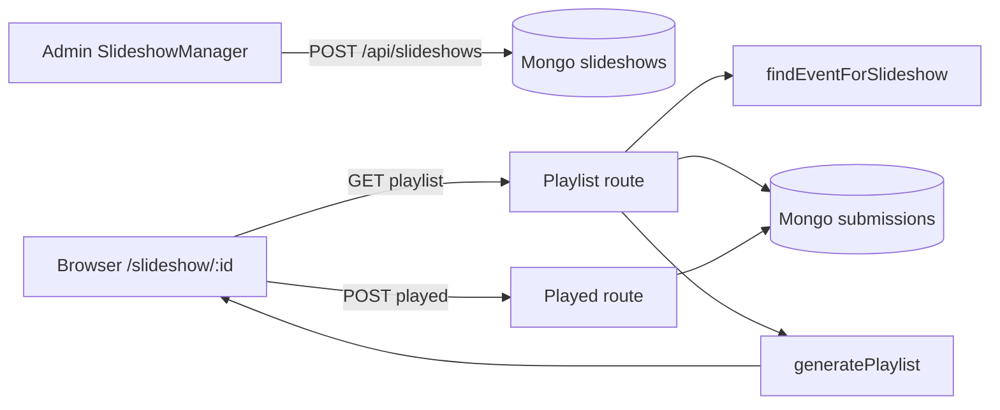

# Event slideshow — architecture and behavior

**Version:** 2.1.0  
**Last updated:** 2026-04-09

This document describes how event slideshows are **created**, how **playlists** are built on the server, and how the **public player** runs in the browser. Use it when changing fairness rules, layouts, timing, or APIs.

**Canonical code references:** `lib/slideshow/playlist.ts`, `app/api/slideshows/`, `app/slideshow/[slideshowId]/page.tsx`, `components/slideshow/SlideshowPlayerCore.tsx`, `components/admin/SlideshowManager.tsx`, `app/api/slideshow-layouts/`, `app/slideshow-layout/[layoutId]/page.tsx`.

---

## Table of contents

1. [Overview](#1-overview)
2. [Public URL and data model](#2-public-url-and-data-model)
3. [Admin: creating and configuring slideshows](#3-admin-creating-and-configuring-slideshows)
4. [Playlist API (`GET …/playlist`)](#4-playlist-api-get-playlist)
5. [Playlist generation (`generatePlaylist`)](#5-playlist-generation-generateplaylist)
6. [Play count API (`POST …/played`)](#6-play-count-api-post-played)
7. [Public player (Slideshow v2)](#7-public-player-slideshow-v2)
8. [Alternate API: `next-candidate`](#8-alternate-api-next-candidate)
9. [Rate limits](#9-rate-limits)
10. [End-to-end flow](#10-end-to-end-flow)
11. [Fine-tuning hooks](#11-fine-tuning-hooks)
12. [Common questions](#12-common-questions)
13. [Slideshow layouts (composite videowall)](#13-slideshow-layouts-composite-videowall)

---

## 1. Overview

The slideshow shows event submissions on a large screen with:

- **Fair rotation** via `playCount` (least played first), then `createdAt` (oldest first).
- **Aspect-aware layouts**: full-frame landscape, or **mosaics** for portrait (3-up) and square (6-up) inside a fixed **16:9** stage.
- A **triple-buffer** player (**A / B / C**) that refetches playlists with **`exclude`** lists so the same image is not duplicated across buffers while one buffer is playing and others are rebuilt.

---

## 2. Public URL and data model

### Public URL

- **`/slideshow/{slideshowId}`** — `slideshowId` is the **string** field on the slideshow document (not the MongoDB `_id`).

### MongoDB: `slideshows` collection

Typical fields (see `ARCHITECTURE.md` / `lib/db/schemas.ts` for full schema):

| Field | Role |
|--------|------|
| `slideshowId` | Public identifier used in URLs |
| `eventId` | **Event UUID** (`event.eventId`) on new rows; older rows may store event Mongo `_id` — resolved via `findEventForSlideshow` |
| `name`, `eventName` | Display labels in the player UI |
| `transitionDurationMs` | Time each slide stays on screen |
| `fadeDurationMs` | Stored for compatibility; **v2 player uses instant cuts** (no cross-fade) |
| `bufferSize` | Default number of slides per playlist fetch (often 10) |
| `refreshStrategy` | `continuous` (default): rebuild finished buffer in background while others play |
| `isActive` | Managed via admin PATCH |

---

## 3. Admin: creating and configuring slideshows

- **UI:** `components/admin/SlideshowManager.tsx` on the event detail page (`app/admin/events/[id]/page.tsx`).
- **Create:** `POST /api/slideshows` (admin session required). Body includes `eventId` (Mongo event `_id`) and `name`. Server stores **`eventId` as the event UUID** for submission matching.
- **List:** `GET /api/slideshows?eventId={uuid}` — `eventId` here is the **event UUID**, not the Mongo `_id`.
- **Update:** `PATCH /api/slideshows?id={mongoId}` — name, buffer size, timings, `refreshStrategy`, `isActive`.
- **Delete:** `DELETE /api/slideshows?id={mongoId}`.

Operators copy the player link as **`{origin}/slideshow/{slideshowId}`**.

---

## 4. Playlist API (`GET …/playlist`)

**Route:** `app/api/slideshows/[slideshowId]/playlist/route.ts`

### Query parameters

| Param | Purpose |
|--------|---------|
| `limit` | Max slides to return; default `slideshow.bufferSize` or 10 |
| `exclude` | Comma-separated **submission `_id`** strings to omit (used so A/B/C buffers do not overlap) |

### Steps

1. **Rate limit:** `RATE_LIMITS.SLIDESHOW_PLAYLIST`.
2. Load slideshow by `slideshowId`; 404 if missing.
3. **Resolve event:** `lib/slideshow/resolve-event.ts` — supports `eventId` stored as Mongo `ObjectId` string **or** event UUID.
4. **Query submissions** with `$match` including:
   - Event: **`eventId` equals event UUID** OR **`eventIds` contains** that UUID (backward compatibility).
   - Not archived: `isArchived` ≠ true.
   - Not hidden for this event: `hiddenFromEvents` missing or not containing the event UUID.
   - **Inactive users:** exclude SSO emails in the inactive set; keep anonymous pseudo users; exclude pseudo users with `userInfo.isActive === false` when applicable.
5. If `exclude` is present, add `_id: { $nin: [ObjectId…] }` for valid ids.
6. **Sort:** `normalizedPlayCount` ascending (`$ifNull(playCount, 0)`), then **`createdAt` ascending**.
7. **`generatePlaylist(submissions, limit)`** → JSON: `slideshow` (settings + ids for client), `playlist`, `totalSubmissions`.

---

## 5. Playlist generation (`generatePlaylist`)

**Module:** `lib/slideshow/playlist.ts`

### Aspect ratio detection (`detectAspectRatio`)

Uses **width/height** from `metadata.finalWidth/Height` (fallback `originalWidth/Height`, defaults 1920×1080). Wide tolerance so real-world photos are rarely skipped:

| Bucket | Approx. ratio range | Layout |
|--------|---------------------|--------|
| Portrait | 0.4 – 0.7 | 3×1 mosaic (3 images) |
| Square | 0.8 – 1.2 | 3×2 mosaic (6 images) |
| Landscape | > 1.2 (and fallback) | Single full-area slide |

### Building slides

Submissions are split into **landscape / square / portrait** arrays, each sorted by **`playCount` then `createdAt`** (same fairness as the API).

Then slides are appended in a loop until **`limit`** or nothing can be added:

1. **One landscape** slide if any landscape remains (single image, `type: 'single'`).
2. **One portrait mosaic** if at least **3** portrait submissions remain (`type: 'mosaic'`, `aspectRatio` portrait).
3. **One square mosaic** if at least **6** square submissions remain (`type: 'mosaic'`, `aspectRatio` square).

If an iteration adds nothing, generation stops (partial pool, e.g. only 2 portraits, is handled gracefully).

### Image URLs in slides

Each slide carries `imageUrl` from `submission.imageUrl` or `submission.finalImageUrl`.

---

## 6. Play count API (`POST …/played`)

**Route:** `app/api/slideshows/[slideshowId]/played/route.ts`

- **Body:** `{ submissionIds: string[] }` (Mongo `_id` strings).
- Validates slideshow exists; updates each submission with `$inc`: `playCount`, `slideshowPlays.{slideshowId}.count`; `$set`: `lastPlayedAt`, per-slideshow last played.
- **Rate limit:** `RATE_LIMITS.SLIDESHOW_PLAYED`.

The player calls this **when a slide becomes visible**, asynchronously (errors must not block playback).

---

## 7. Public player (Slideshow v2)

**Route:** `app/slideshow/[slideshowId]/page.tsx` (client component).

### Startup

1. `GET /api/slideshows/{id}/playlist` → first playlist → **playlist A**; preload images.
2. Fetch **B** with `?exclude=` all submission ids in A.
3. Fetch **C** with `?exclude=` ids in **A ∪ B**.
4. Optional **loading branding:** if slideshow has `eventId` (Mongo id in response), `GET /api/events/{eventId}/logos` and use the active logo in slot **`loading-slideshow`**.

### Playback

- **Active buffer:** one of A / B / C; **`currentIndex`** walks that buffer.
- **Advance:** `setTimeout(transitionDurationMs)` then next index or **rotate** to the next playlist at end.
- **Rotation:** A → B → C → A. When a buffer ends, the next buffer becomes active; if `refreshStrategy === 'continuous'`, the **finished** buffer is rebuilt via `GET …/playlist?exclude=` (ids from the **two** buffers that are not being rebuilt).
- **Transitions:** **Instant cut** between slides (comments in code; `fadeDurationMs` is not applied as a cross-fade in this version).

### Layout

- Viewport: **centered 16:9** box (`vw`/`vh` with max constraints) on black.
- **Single:** one image, `object-fit: contain`.
- **Square mosaic:** six cells in a 3×2 grid (absolute positioning).
- **Portrait mosaic:** three columns, full height.

### Controls

- Play/pause, fullscreen (**F**), **Space** toggles play, arrow keys step slides; overlay auto-hides in fullscreen after mouse idle.

---

## 8. Alternate API: `next-candidate`

**Route:** `app/api/slideshows/[slideshowId]/next-candidate/route.ts`

Returns a **single** next slide using similar filtering and `generatePlaylist` with a limit of 1, with optional `excludeIds`. The **v2 player** primarily uses **full playlist** fetches with `exclude`, not this endpoint; keep in mind if you build a different client.

---

## 9. Rate limits

Defined in `lib/api` (`RATE_LIMITS`):

- `SLIDESHOW_PLAYLIST` — playlist GET  
- `SLIDESHOW_PLAYED` — played POST  
- `SLIDESHOW_NEXT` — next-candidate GET  

Adjust there if public screens hit limits during large events.

---

## 10. End-to-end flow

---

## 11. Fine-tuning hooks

| Goal | Where to change |
|------|------------------|
| Who appears in the pool | `$match` in `playlist/route.ts` (archived, hidden, inactive users) |
| Fairness ordering | Aggregate `$sort` in playlist route + per-bucket sort in `playlist.ts` |
| Mosaic sizes / order of landscape vs mosaics | `generatePlaylist` loop in `playlist.ts` |
| Slide duration / buffer size | Slideshow document + `SlideshowManager` PATCH |
| Visual layout / 16:9 box | `renderSlide` and container styles in `page.tsx` |
| API throttling | `RATE_LIMITS` in `lib/api` |

---

## 12. Common questions

### Why are some photos shown in a grid?

Portrait and square shots are grouped into mosaics so a **16:9** display is used efficiently; a single tall image would leave large empty side areas.

### Why is a photo not showing?

Check archived flag, `hiddenFromEvents`, higher `playCount` (it will surface later), or dimension metadata if categorization misbehaves.

### Does the player fade between slides?

**Current v2 behavior:** **no** cross-fade; cuts are instant. `fadeDurationMs` remains in the model for potential future use or other clients.

### How does the playlist stay fresh?

Each playlist request re-queries Mongo with current `playCount`, so after `played` increments, ordering shifts. New submissions appear on the next fetch that includes them in the match.

---

**Maintained by:** Camera / Frame-It-Now development  
**See also:** `ARCHITECTURE.md` (collections, API index), `lib/slideshow/resolve-event.ts`

---

## 13. Slideshow layouts (composite videowall)

A **layout** combines several **existing slideshows** on one screen. Each **region** (group of grid tiles) references one `slideshowId` and optional **delay** / **object-fit** (`contain` = scale to fit, `cover` = scale to fill; aspect ratio is always preserved).

| Item | Detail |
|------|--------|
| **Public URL** | `/slideshow-layout/{layoutId}` |
| **MongoDB** | Collection `slideshow_layouts` (`COLLECTIONS.SLIDESHOW_LAYOUTS`) |
| **Public API** | `GET /api/slideshow-layouts/[layoutId]` (rate limit `SLIDESHOW_LAYOUT_GET`) |
| **Admin API** | `POST` / `GET ?eventId=` / `PATCH ?id=` / `DELETE ?id=` on `/api/slideshow-layouts` |
| **Admin UI** | Event page → **Event Slideshow Layouts**; edit → `/admin/events/[id]/layouts/[layoutMongoId]` (grid builder) |
| **Player** | `SlideshowPlayerCore` with `variant="embedded"` per region; shared logic with single `/slideshow/[slideshowId]` |

**Delay:** On each embedded player, `delayMs` extends the **first** slide duration only, so two cells using the same slideshow start their rotation out of phase.

**Indexes:** Run `npm run db:ensure-indexes` for `layoutId` (unique) and `eventId + createdAt`.

**Planning notes:** `docs/PLAN_SLIDESHOW_LAYOUT.md`
