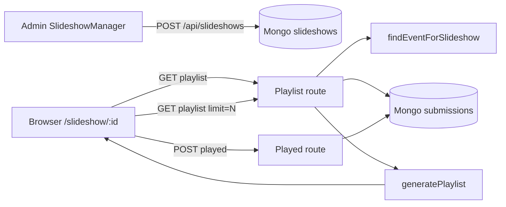

# Event slideshow — architecture and behavior

**Version:** 2.3.0  
**Last updated:** 2026-04-09

This document describes how event slideshows are **created**, how **playlists** are built on the server, and how the **public player** runs in the browser. Use it when changing fairness rules, layouts, timing, or APIs.

**Canonical code references:** `lib/slideshow/playlist.ts`, `app/api/slideshows/`, **`components/slideshow/SlideshowPlayerCore.tsx`** (player implementation), thin wrapper `app/slideshow/[slideshowId]/page.tsx`, `components/admin/SlideshowManager.tsx`, `app/api/slideshow-layouts/`, `app/slideshow-layout/[layoutId]/page.tsx`.

**Doc maintenance:** See `docs/DOCUMENTATION.md` for how to keep this file aligned with code.

---

## Table of contents

1. [Overview](#1-overview)
2. [Public URL and data model](#2-public-url-and-data-model)
3. [Admin: creating and configuring slideshows](#3-admin-creating-and-configuring-slideshows)
4. [Playlist API (`GET …/playlist`)](#4-playlist-api-get-playlist)
5. [Playlist generation (`generatePlaylist`)](#5-playlist-generation-generateplaylist)
6. [Play count API (`POST …/played`)](#6-play-count-api-post-played)
7. [Public player (`SlideshowPlayerCore`)](#7-public-player-slideshowplayercore)
8. [Alternate API: `next-candidate`](#8-alternate-api-next-candidate)
9. [Rate limits](#9-rate-limits)
10. [End-to-end flow](#10-end-to-end-flow)
11. [Fine-tuning hooks](#11-fine-tuning-hooks)
12. [Common questions](#12-common-questions)
13. [Slideshow layouts (composite videowall)](#13-slideshow-layouts-composite-videowall)

---

## 1. Overview

The slideshow shows event submissions on a large screen with:

- **Fair rotation** via `playCount` (least played first), then `createdAt` (oldest first). With **`orderMode: 'random'`**, the server **shuffles** before `generatePlaylist` (`playlist/route.ts`): **unkeyed** clients use `Math.random()` (Fisher–Yates); with **`instanceKey`** (`layoutId:areaId` on layouts), shuffle is **seeded** (`hash(instanceKey) XOR` per-request salt) so duplicate `slideshowId` cells get **different** orderings. With **`orderMode: 'fixed'`** and **`instanceKey`**, the sorted list is **cyclically rotated** by `hash(instanceKey) mod N` so cells do **not** all start on the same head (otherwise every tile shows the same first slide).
- **Aspect-aware layouts**: full-frame landscape, or **mosaics** for portrait (3-up) and square (6-up) inside a fixed **16:9** stage.
- A **FIFO slide queue** in the browser (`SlideshowPlayerCore`): **`bufferSize`** is only a **target queue depth** for smooth playback (not “how many slides total”). Initial **`GET …/playlist`** seeds the queue; in **loop** mode the client **tops the queue back up** toward `bufferSize` with **`GET …/playlist?limit=N`** (`maintainLoopBuffer`) after each advance and on a light interval—playback does not end when the buffer is consumed. **`playMode: 'once'`** still drains the initial queue without loop refill.

---

## 2. Public URL and data model

### Public URL

- **`/slideshow/{slideshowId}`** — `slideshowId` is the **string** field on the slideshow document (not the MongoDB `_id`).

### MongoDB: `slideshows` collection

Typical fields (see `ARCHITECTURE.md` / `lib/db/schemas.ts` for full schema):

| Field | Role |
|--------|------|
| `slideshowId` | Public identifier used in URLs |
| `eventId` | **Event UUID** (`event.eventId`) on new rows; older rows may store event Mongo `_id` — resolved via `findEventForSlideshow` |
| `name`, `eventName` | Display labels in the player UI |
| `transitionDurationMs` | Time each slide stays on screen (**milliseconds**; admin UI uses ms) |
| `fadeDurationMs` | **Milliseconds**; stored for compatibility — **player uses instant cuts** (no cross-fade) |
| `bufferSize` | Default number of slides returned by **`GET …/playlist`** without `limit` (often 10); seeds the client queue |
| `refreshStrategy` | `continuous` \| `batch` — stored on the document; **current `SlideshowPlayerCore` does not branch on this** (legacy / future use) |
| `playMode` | `loop` (default) \| `once` — stop after one pass through the initial queue |
| `orderMode` | `fixed` (default) \| `random` — server-side shuffle of matched submissions before mosaic grouping |
| `backgroundPrimaryColor`, `backgroundAccentColor` | Failover gradient (hex); see player for black-until-ready behavior with optional `backgroundImageUrl` |
| `backgroundImageUrl` | Optional imgbb URL; preload before first paint when possible |
| `viewportScale` | `fit` \| `fill` — how the **16:9 stage** fits the **fullscreen** viewport only; **ignored for stage-in-cell sizing in layouts** (see §13) |
| `isActive` | Managed via admin PATCH |

---

## 3. Admin: creating and configuring slideshows

- **UI:** `components/admin/SlideshowManager.tsx` on the event detail page (`app/admin/events/[id]/page.tsx`).
- **Create:** `POST /api/slideshows` (admin session required). Body includes `eventId` (Mongo event `_id`) and `name`. Server stores **`eventId` as the event UUID** for submission matching.
- **List:** `GET /api/slideshows?eventId={uuid}` — `eventId` here is the **event UUID**, not the Mongo `_id`.
- **Update:** `PATCH /api/slideshows?id={mongoId}` — name, buffer size, timings, `refreshStrategy`, `isActive`, `playMode`, `orderMode`, gradient colors, `backgroundImageUrl`, `viewportScale` (see `app/api/slideshows/route.ts`).
- **Failover image upload (admin):** `POST /api/slideshows/{slideshowId}/background-image` (multipart) — returns URL suitable for `backgroundImageUrl` on the slideshow document.
- **Delete:** `DELETE /api/slideshows?id={mongoId}`.

Operators copy the player link as **`{origin}/slideshow/{slideshowId}`**.

---

## 4. Playlist API (`GET …/playlist`)

**Route:** `app/api/slideshows/[slideshowId]/playlist/route.ts`

### Query parameters

| Param | Purpose |
|--------|---------|
| `limit` | Max slides to return; default `slideshow.bufferSize` or 10 |
| `exclude` | Comma-separated **submission `_id`** strings to omit from the aggregate `$match` (for alternate clients or experiments; **`SlideshowPlayerCore` prefetch does not pass `exclude` today**) |
| `instanceKey` | Optional string (trimmed, max 256 chars). **Layouts** pass **`{layoutId}:{area.id}`** so keys stay unique. **`random`:** seeded shuffle (`hash(key) XOR` per-request salt) so regions differ. **`fixed`:** cyclic **rotate** of the fairness-sorted list by `hash(key) mod N` so regions do not mirror the same first slide. **`generatePlaylist`** preserves submission order inside aspect buckets (it does **not** re-sort by `playCount`), or per-cell shuffle/rotate would be undone. Responses use **`Cache-Control: private, no-store`**. Omit on `/slideshow/{id}` fullscreen (unchanged behavior). |

### Steps

1. **Rate limit:** `RATE_LIMITS.SLIDESHOW_PLAYLIST`.
2. Load slideshow by `slideshowId`; 404 if missing.
3. **Resolve event:** `lib/slideshow/resolve-event.ts` — supports `eventId` stored as Mongo `ObjectId` string **or** event UUID.
4. **Query submissions** with `$match` including:
   - Event: **`eventId` equals event UUID** OR **`eventIds` contains** that UUID (backward compatibility).
   - Not archived: `isArchived` ≠ true.
   - Not hidden for this event: `hiddenFromEvents` missing or not containing the event UUID.
   - **Inactive users:** exclude SSO emails in the inactive set; keep anonymous pseudo users; exclude pseudo users with `userInfo.isActive === false` when applicable.
5. If `exclude` is present, add `_id: { $nin: [ObjectId…] }` for valid ids.
6. **Sort:** `normalizedPlayCount` ascending (`$ifNull(playCount, 0)`), then **`createdAt` ascending**.
7. If **`orderMode` is `random`** and there is more than one submission: **shuffle** in place—**seeded** when `instanceKey` is set, else **`shuffleInPlace`**. Else if **`instanceKey`** is set and there is more than one submission: **`rotateLeftBy`** (`lib/slideshow/playlist.ts`) by `fnv1a32(instanceKey) % length` so **fixed** order still **desyncs** across layout cells.
8. **`generatePlaylist(submissions, limit)`** → JSON: `slideshow` (settings + ids for client), `playlist`, `totalSubmissions` (response headers: **no-store**).

---

## 5. Playlist generation (`generatePlaylist`)

**Module:** `lib/slideshow/playlist.ts`

### Aspect ratio detection (`detectAspectRatio`)

Uses **width/height** from `metadata.finalWidth/Height` (fallback `originalWidth/Height`, defaults 1920×1080). Wide tolerance so real-world photos are rarely skipped:

| Bucket | Approx. ratio range | Layout |
|--------|---------------------|--------|
| Portrait | 0.4 – 0.7 | 3×1 mosaic (3 images) |
| Square | 0.8 – 1.2 | 3×2 mosaic (6 images) |
| Landscape | > 1.2 (and fallback) | Single full-area slide |

### Building slides

Submissions are split into **landscape / square / portrait** arrays **in caller order** (fairness + shuffle/rotate already applied in the playlist route). The buckets are **not** re-sorted, so layout **`instanceKey`** streams stay independent.

Then slides are appended in a loop until **`limit`** or nothing can be added:

1. **One landscape** slide if any landscape remains (single image, `type: 'single'`).
2. **One portrait mosaic** if at least **3** portrait submissions remain (`type: 'mosaic'`, `aspectRatio` portrait).
3. **One square mosaic** if at least **6** square submissions remain (`type: 'mosaic'`, `aspectRatio` square).

If an iteration adds nothing, generation stops (partial pool, e.g. only 2 portraits, is handled gracefully).

### Image URLs in slides

Each slide carries `imageUrl` from `submission.imageUrl` or `submission.finalImageUrl`.

---

## 6. Play count API (`POST …/played`)

**Route:** `app/api/slideshows/[slideshowId]/played/route.ts`

- **Body:** `{ submissionIds: string[] }` (Mongo `_id` strings).
- Validates slideshow exists; updates each submission with `$inc`: `playCount`, `slideshowPlays.{slideshowId}.count`; `$set`: `lastPlayedAt`, per-slideshow last played.
- **Rate limit:** `RATE_LIMITS.SLIDESHOW_PLAYED`.

The player calls this **when a slide becomes visible**, asynchronously (errors must not block playback).

---

## 7. Public player (`SlideshowPlayerCore`)

**Route:** `app/slideshow/[slideshowId]/page.tsx` imports **`SlideshowPlayerCore`** with `variant="fullscreen"` (client component).

### Startup

1. Black full-viewport shell (no loading copy); optional **loading-slideshow** logo from `GET /api/events/{eventId}/logos` when `eventId` is present on the slideshow payload.
2. `GET /api/slideshows/{id}/playlist` (optional `instanceKey` for layout cells) → `slideshow` settings + `playlist` array (length ≤ `bufferSize` unless `limit` query overrides).
3. Preload all slide images and optional **`backgroundImageUrl`** before hiding the loading shell.
4. In **loop** mode, **`maintainLoopBuffer`** calls **`GET /api/slideshows/{id}/playlist?limit=N`** (same `instanceKey` when embedded) so the queue trends toward **`bufferSize`**; this does not cap how long the show runs.

### Playback

- **Queue:** React state `slideQueue` — head is the visible slide.
- **Advance (loop):** after **`transitionDurationMs`** (+ optional layout `delayMs` on the first tick only), **pop** the head, then **refill** the tail toward `bufferSize`. Timer duration is **not** reset by queue refills.
- **Advance (once):** pop head until one slide left; then stop and show end UI.
- **Transitions:** if **`fadeDurationMs` > 0**, an **opacity ease** runs on the slide layer between advances (first slide skips fade). If **0**, the cut is instant.

### Layout (fullscreen)

- **16:9 stage** sized with `slideshowStageDimensions` from `lib/slideshow/viewport-scale.ts` using slideshow **`viewportScale`** (`fit` = letterbox stage in window, `fill` = cover).
- **Single:** one `` filling the stage; `object-fit` follows component default **`contain`** for fullscreen.
- **Square mosaic:** six cells in a 3×2 grid (absolute positioning).
- **Portrait mosaic:** three columns, full height.

### Embedded (layouts)

- Same component with `variant="embedded"`, per-region **`instanceKey`** (`layoutId:areaId` for independent queues), and per-region **`objectFit`** (`contain` \| `cover`). **Stage-in-cell** fit/fill is driven by this prop (not by slideshow `viewportScale`). See §13.

### Controls (fullscreen only)

- Play/pause, fullscreen (**F**), **Space** toggles play, arrow keys step slides; overlay auto-hides in fullscreen after mouse idle.

---

## 8. Alternate API: `next-candidate`

**Route:** `app/api/slideshows/[slideshowId]/next-candidate/route.ts`

Returns a **single** next slide using similar filtering and `generatePlaylist` with a limit of 1, with optional `excludeIds`. **`SlideshowPlayerCore` tops up via `…/playlist?limit=N`**, not this route—keep both when evolving server logic.

---

## 9. Rate limits

Defined in `lib/api` (`RATE_LIMITS`):

- `SLIDESHOW_PLAYLIST` — playlist GET  
- `SLIDESHOW_PLAYED` — played POST  
- `SLIDESHOW_NEXT` — next-candidate GET  

Adjust there if public screens hit limits during large events.

---

## 10. End-to-end flow

---

## 11. Fine-tuning hooks

| Goal | Where to change |
|------|------------------|
| Who appears in the pool | `$match` in `playlist/route.ts` (archived, hidden, inactive users) |
| Fairness ordering | Aggregate `$sort` in playlist route; **`orderMode: random`** (and **`instanceKey` rotate** when fixed) apply **before** `generatePlaylist`, which **keeps** that order within each aspect bucket (no extra per-bucket sort). |
| Mosaic sizes / order of landscape vs mosaics | `generatePlaylist` loop in `playlist.ts` |
| Slide duration / buffer size | Slideshow document + `SlideshowManager` PATCH |
| Visual layout / 16:9 stage / fullscreen fit vs fill | `SlideshowPlayerCore.tsx` + `lib/slideshow/viewport-scale.ts` |
| Client queue / buffer | `SlideshowPlayerCore.tsx` (`slideQueue`, `maintainLoopBuffer`, `fetchPlaylistChunk`) |
| API throttling | `RATE_LIMITS` in `lib/api` |

---

## 12. Common questions

### Why are some photos shown in a grid?

Portrait and square shots are grouped into mosaics so a **16:9** display is used efficiently; a single tall image would leave large empty side areas.

### Why is a photo not showing?

Check archived flag, `hiddenFromEvents`, higher `playCount` (it will surface later), or dimension metadata if categorization misbehaves.

### Does the player fade between slides?

**Current player behavior:** **no** cross-fade; cuts are instant. `fadeDurationMs` remains in the model for potential future use or other clients.

### How does the playlist stay fresh?

Each playlist request re-queries Mongo with current `playCount`, so after `played` increments, ordering shifts. New submissions appear on the next fetch that includes them in the match.

---

**Maintained by:** Camera / Frame-It-Now development  
**See also:** `ARCHITECTURE.md` (collections, API index), `lib/slideshow/resolve-event.ts`

---

## 13. Slideshow layouts (composite videowall)

A **layout** combines several **existing slideshows** on one screen. Each **region** (group of grid tiles) references one `slideshowId` and optional **delay** / **`objectFit`** (`contain` = fit **16:9 stage** inside tile, `cover` = stage **covers** tile with overflow clipped). Implemented in **`SlideshowPlayerCore`** (`variant="embedded"`); this is **not** the same as slideshow **`viewportScale`** (fullscreen only).

| Item | Detail |
|------|--------|
| **Public URL** | `/slideshow-layout/{layoutId}` |
| **MongoDB** | Collection `slideshow_layouts` (`COLLECTIONS.SLIDESHOW_LAYOUTS`) |
| **Public API** | `GET /api/slideshow-layouts/[layoutId]` (rate limit `SLIDESHOW_LAYOUT_GET`) |
| **Admin API** | `POST` / `GET ?eventId=` / `PATCH ?id=` / `DELETE ?id=` on `/api/slideshow-layouts` |
| **Admin UI** | Event page → **Event Slideshow Layouts**; edit → `/admin/events/[id]/layouts/[layoutMongoId]` (grid builder) |
| **Player** | `SlideshowPlayerCore` with `variant="embedded"` and **`instanceKey={layoutId + ':' + area.id}`** per region; shared logic with single `/slideshow/[slideshowId]` (fullscreen omits `instanceKey`) |
| **Grid outer size** | `layoutGridStageDimensions` picks pixel size to fit the viewport; the stage wrapper also sets CSS **`aspect-ratio: (cols×16)/(rows×9)`** (`layoutGridAspectRatioCss`) so letterbox **fit** cannot squash the videowall if `max-*` clamps one side. **Fill** omits `max-width`/`max-height` so overflow can crop as intended. |
| **Embedded player** | `SlideshowPlayerCore` **fills each grid cell** (`100%`×`100%`); it does **not** force an inner 16:9 letterbox inside the cell, so a **spanned** region keeps **(spanCols×16):(spanRows×9)** (e.g. 2×1 → 32:9). |
| **Gaps** | Public grid uses **`gap: 0`** (one rigid videowall); admin builder preview also uses **no gap** so WYSIWYG. |
| **Unused tracks** | On **`/slideshow-layout/...`**, rows/columns that contain **no tiles** from any area are **collapsed** (`computeCompactGridSpec` in `layout-geometry.ts`), so checkerboard-style definitions (e.g. images on rows 0,2,4 of a 6-row logical grid) render as **contiguous** image bands without blank “stripe” rows showing only the outer background. |

**Delay:** On each embedded player, `delayMs` extends the **first** slide duration only, so two cells using the same slideshow start their rotation out of phase.

**Random order:** With **`orderMode: 'random'`**, each region’s **`instanceKey`** forces a **separate** shuffle from other regions (including those pointing at the same `slideshowId`), so tiles are expected to show **different** images, not mirror the same permutation.

**Indexes:** Run `npm run db:ensure-indexes` for `layoutId` (unique) and `eventId + createdAt`.

**Planning notes:** `docs/PLAN_SLIDESHOW_LAYOUT.md`
